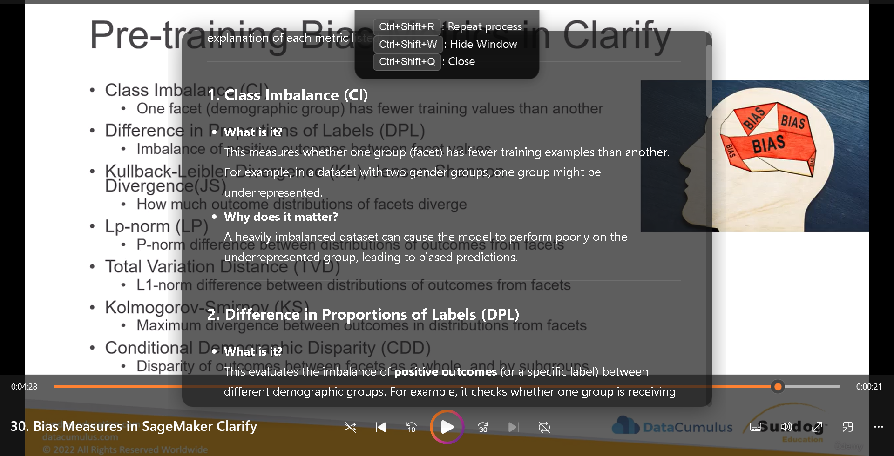

# GlassMind: The Visual Assistant

<p align="center">
  
  
  
</p>

GlassMind is a screenshot-powered assistant that helps you understand the content on your screen using OpenAI technology.

<p align="center">
  
</p>

## Features

- **Screenshot-to-Insight:** Capture any part of your screen for AI analysis
- **Multi-Page Support:** Capture and analyze multi-step content
- **Floating Glass UI:** Transparent, always-on-top interface
- **Global Shortcuts:** Customizable keyboard shortcuts
- **Markdown Rendering:** Rich formatting and syntax highlighting

## Project Structure

```
glassmind/
├── src/                       # Source code directory
│   ├── css/                   # Stylesheets
│   ├── js/                    # JavaScript code
│   │   ├── services/          # Service modules
│   │   ├── ui/                # UI-related code
│   │   ├── utils/             # Utility functions
│   │   ├── app-controller.js  # Main application controller
│   │   └── main.js            # Application entry point
├── docs/                      # Documentation
├── index.html                 # Main application HTML
├── settings.html              # Settings window HTML
├── settings.json              # Keyboard shortcuts configuration
├── start.js                   # Application startup script
├── config.json                # API configuration
└── package.json               # Project metadata and dependencies
```

## Prerequisites

- [Node.js](https://nodejs.org/) (v14 or later)
- [npm](https://www.npmjs.com/) or [yarn](https://yarnpkg.com/)
- An OpenAI API key with Vision access

## Installation

1. **Clone the repository:**

   ```bash
   git clone https://github.com/mouadenna/glassmind.git
   cd glassmind
   ```

2. **Install dependencies:**

   ```bash
   npm install
   ```

3. **Start the application:**

   ```bash
   npm start
   ```

4. **Edit the config.json file:**

   Add your OpenAI API key to the `config.json` file:

   ```json
   {
     "apiKey": "YOUR_OPENAI_API_KEY",
     "model": "gpt-4o-mini"
   }
   ```

5. **Start the application again:**

   ```bash
   npm start
   ```

## Keyboard Shortcuts

| Shortcut              | Action                                      |
|-----------------------|---------------------------------------------|
| `Ctrl + Shift + S`    | Capture screenshot & process it             |
| `Ctrl + Shift + A`    | Start/continue multi-page capture           |
| `Ctrl + Shift + I`    | Open text input                             |
| `Ctrl + P`            | Open settings                               |
| `Ctrl + Shift + W`    | Toggle window visibility                    |
| `Ctrl + Shift + R`    | Reset/clear the current session             |
| `Ctrl + Shift + Q`    | Quit the application                        |
| `Ctrl + Arrow Keys`   | Move window (Left, Right, Up, Down)         |
| `Ctrl + C`            | Center window on screen                     |
| `Ctrl + U / D`        | Scroll AI response up/down                  |

## Building for Production

```bash
# Windows
npm run build:win

# macOS
npm run build:mac

# Linux
npm run build:linux

# All platforms
npm run build
```

## Contributing

1. Fork the repository
2. Create your feature branch (`git checkout -b feature/amazing-feature`)
3. Commit your changes (`git commit -m 'Add some amazing feature'`)
4. Push to the branch (`git push origin feature/amazing-feature`)
5. Open a Pull Request

## License

This project is licensed under the MIT License. See the [LICENSE](LICENSE) file.

## Disclaimer

GlassMind is intended for educational, productivity, and personal use. Please adhere to the terms of service for any third-party content or platforms you interact with.
